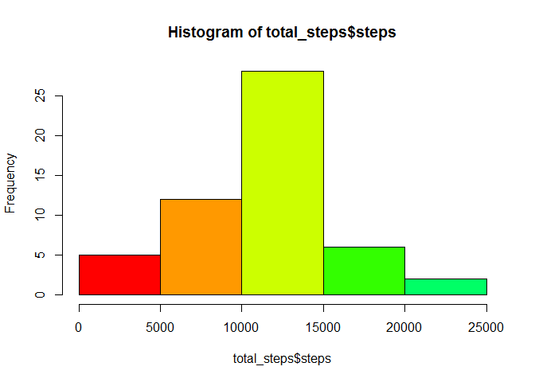
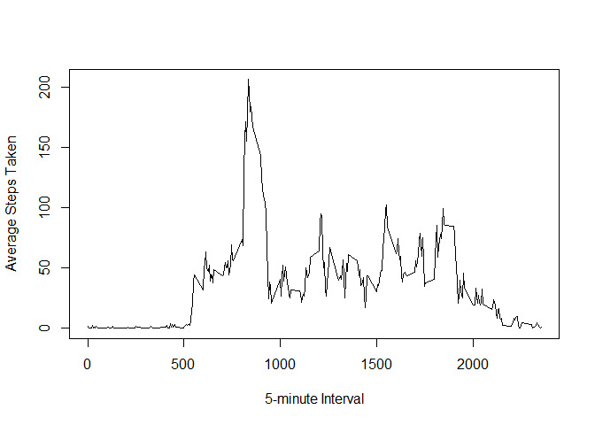
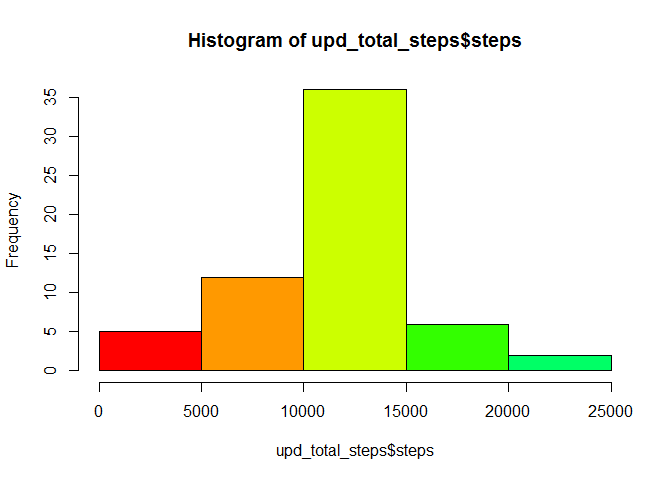
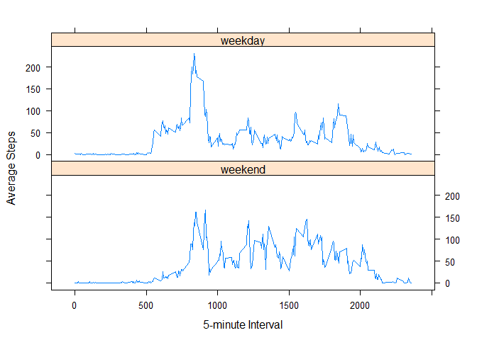

Reproducible Research: Peer Assessment 1
==========================================

*- by: Dinesh Srivastava*


This assignment makes use of data from a personal activity monitoring device. 
This device collects data at 5 minute intervals through out the day.
  

##  General Program Housekeeping


```r
##Set working Directory
        projectWD <- "C:/Users/DKSrivastava/RepData_PeerAssessment1/" 
        setwd(projectWD)

## Source some desired libraries
        library(datasets)
        library(data.table)
        library(lattice)
        library(knitr)
```

```
## Warning: package 'knitr' was built under R version 3.1.1
```

```r
## R Script to be used for generating final HTML amd md documents.
        #knit2html("PA1_template.Rmd")
```
  
  

## Loading and preprocessing the data

This section covers reading and processing of "Activity Monitoring Data".  


```r
# Reading the Activity Monitoring Data.
        activity_data <- read.csv("./activity.csv", header=TRUE)

# Verify headers
        names(activity_data)
```

```
## [1] "steps"    "date"     "interval"
```

```r
# Display few rows of data
        head(activity_data)
```

```
##   steps       date interval
## 1    NA 2012-10-01        0
## 2    NA 2012-10-01        5
## 3    NA 2012-10-01       10
## 4    NA 2012-10-01       15
## 5    NA 2012-10-01       20
## 6    NA 2012-10-01       25
```

```r
# Remove all NA's
        clean_data <- activity_data[!is.na(activity_data$steps),]
        head(clean_data)
```

```
##     steps       date interval
## 289     0 2012-10-02        0
## 290     0 2012-10-02        5
## 291     0 2012-10-02       10
## 292     0 2012-10-02       15
## 293     0 2012-10-02       20
## 294     0 2012-10-02       25
```
  
  

## What is mean total number of steps taken per day?

This section calculates the **Mean** and **Median** of total number of steps taken per day.


```r
# Draw a histogram of total number of steps taken each day.
        total_steps <- aggregate(steps ~ date, data = clean_data, sum)
        hist(total_steps$steps, col=rainbow(10))
```

 


```r
# Calculate the "mean" of total number of steps taken per day
        cmn <- mean(total_steps$steps)  ## calculated mean
        cmn
```

```
## [1] 10766
```

```r
        cmdn <- median(total_steps$steps)  ## calculated median
        cmdn
```

```
## [1] 10765
```

- The **mean** of total number of steps taken each day is **1.0766 &times; 10<sup>4</sup>** steps.
- The **median** of total number of steps taken each day is **10765** steps.

  
## What is the average daily activity pattern?


1. Make a time series plot (i.e. `type = "l"`) of the 5-minute interval (x-axis) and the average number of steps taken, averaged across all days (y-axis)


```r
        steps_interval <- aggregate(steps ~ interval, data = clean_data, mean, na.rm = TRUE)
        plot(steps ~ interval, data = steps_interval, type = "l", 
             xlab="5-minute Interval", ylab="Average Steps Taken")
```

 


2. Which 5-minute interval, on average across all the days in the dataset, contains the maximum number of steps?


```r
# Calculated interval
        cintvl <- steps_interval[which.max(steps_interval$steps), ]$interval
        cintvl
```

```
## [1] 835
```


As can be seen, the **835 th** time interval corresponds to the maximum number of steps. 

  
  
## Imputing missing values

This section deals with the data issuse arising from missing values (coded as 'NA') in the available dataset.    
  
  
1. Calculate and report the total number of missing values in the dataset (i.e. the total number of rows with 'NA's)


```r
# Calculate total number of rows with NA's
        crows <- sum(is.na(activity_data$steps))
        crows
```

```
## [1] 2304
```

- Total **2304** rows has missing data in the given dataset.
        
2. **Data Strategy Used**: Replace all missing values with the mean for that 5-minute interval.


```r
# Get the mean steps for particular 5-minute interval
        mean_interval <- function(interval) {
                steps_interval[steps_interval$interval == interval, ]$steps
        }
```

  
3. Create a new dataset that is equal to the original dataset but with the missing data filled in.


```r
# Create a new dataset that is equal to the original dataset but with the missing data filled in.
        upd_activity_data <- activity_data  # Make a new dataset with the original data
        count = 0  # Count the number of data filled in
        for (i in 1:nrow(upd_activity_data)) {
                if (is.na(upd_activity_data[i, ]$steps)) {
                        upd_activity_data[i, ]$steps <- mean_interval(upd_activity_data[i, ]$interval)
                        count = count + 1
                }
        }

# Display total coult of values replaced
        cat("Total ", count, "NA values were filled.\n")
```

```
## Total  2304 NA values were filled.
```
  
  
4. Make a histogram of the total number of steps taken each day and Calculate and report the **mean** and **median** total number of steps taken per day. Do these values differ from the estimates from the first part of the assignment? What is the impact of imputing missing data on the estimates of the total daily number of steps?

  

```r
# Draw a histogram of total number of steps taken each day.
        upd_total_steps <- aggregate(steps ~ date, data = upd_activity_data, sum)
        hist(upd_total_steps$steps, col=rainbow(10))
```

 


```r
# Calculate the "mean" of total number of steps taken per day for updated activity dataset
        cmn_upd <- mean(upd_total_steps$steps)  ## calculated mean
        cmn_upd
```

```
## [1] 10766
```

```r
        cmdn_upd <- median(upd_total_steps$steps)  ## calculated median
        cmdn_upd
```

```
## [1] 10766
```

- The **mean** of total number of steps taken each day is **1.0766 &times; 10<sup>4</sup>** steps.
- The **median** of total number of steps taken each day is **1.0766 &times; 10<sup>4</sup>** steps.
  
**Note:** The mean value remains same because we replaced missing values with the  mean value for that particular 5-min interval. The median value shows a little difference and it depends on where the missing values were.  
  
    
    
## Are there differences in activity patterns between weekdays and weekends?


1. Create a new factor variable in the dataset with two levels -- "weekday" and "weekend" indicating whether a given date is a weekday or weekend day.


```r
# Create a two new factor variables
        upd_activity_data$day_type <- ifelse(weekdays(as.Date(upd_activity_data$date)) 
                                             %in% c("Saturday", "Sunday"), "weekend", "weekday")  

        upd_activity_data_weekday <- upd_activity_data[upd_activity_data$day_type == "weekday",]
        mean_steps_weekday <- tapply(upd_activity_data_weekday$steps, 
                                     upd_activity_data_weekday$interval, mean)

        upd_activity_data_weekend <- upd_activity_data[upd_activity_data$day_type == "weekend",]
        mean_steps_weekend <- tapply(upd_activity_data_weekend$steps, 
                                     upd_activity_data_weekend$interval, mean)

        mean_steps_weekday <- cbind(intervals=rownames(mean_steps_weekday), 
                                    mean_steps=mean_steps_weekday, type="weekday")
        mean_steps_weekend <- cbind(intervals=rownames(mean_steps_weekend), 
                                    mean_steps=mean_steps_weekend, type="weekend")
```


2. Make a panel plot containing a time series plot (i.e. `type = "l"`) of the 5-minute interval (x-axis) and the average number of steps taken, averaged across all weekday days or weekend days (y-axis).


```r
# make the panel plot for weekdays and weekends
        new_dataframe <- as.data.frame(rbind(mean_steps_weekday, mean_steps_weekend))
        new_dataframe$mean_steps <- as.numeric(as.character(new_dataframe$mean_steps))
        new_dataframe$intervals <- as.integer(as.character(new_dataframe$intervals))

        xyplot (mean_steps~intervals|type, data=new_dataframe, type="l",layout=c(1, 2), as.table=T, 
                xlab="5-minute Interval", ylab="Average Steps")
```

 

- **Observed Activity Pattern:** A visual inspection of above plotting indicates that the average number of steps taken during weekends are higher than the average number of steps taken during weekdays for most of time intervals.

**= = = = = = = = = = = = = = = = = = = = = = = = = = = = = = = = = = = = = =**


